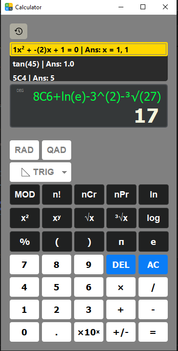

<h1 align="center" >🧮 PyQt6 Calculator  </h1> 

------
This is a GUI based calculator made from PyQt6 that is designed to perform simple calculations along with additional methods like Combination, Permutation, ln, log, sq root, cube root, etc.

 <table border="0" cellspacing="0" cellpadding="0">
    <tr>
        <td align="left" valign="top">
            <h3> 🚀Features </h3>
            <ul>
                <li><b>Quadratic Mode</li>
                <li>Trignometric Mode</li>
                <li>Rad / Deg Mode</li> 
                <li>History Saver</li>
            </ul>
            <h3>⚠️Limitaions</h3>
            <ul>
                <li>Specific error not visible</li>
                <li>Yet to be found</b></li>
        </td>
        <td align="center">
            
        </td>
    </tr>
</table>

-----
### 🛠️Installation
###### Clone the Project
```bash
git clone https://github.com/BrishkamalKarki/calculator.git
cd calculator
```
###### Install Dependencies
```bash
pip install PyQt6  
```
###### Run the Calculator
```bash
python main.py
```
-----
### 👤 Author
**Brishkamal Karki A.K.A Karna Raj Karki**

-----